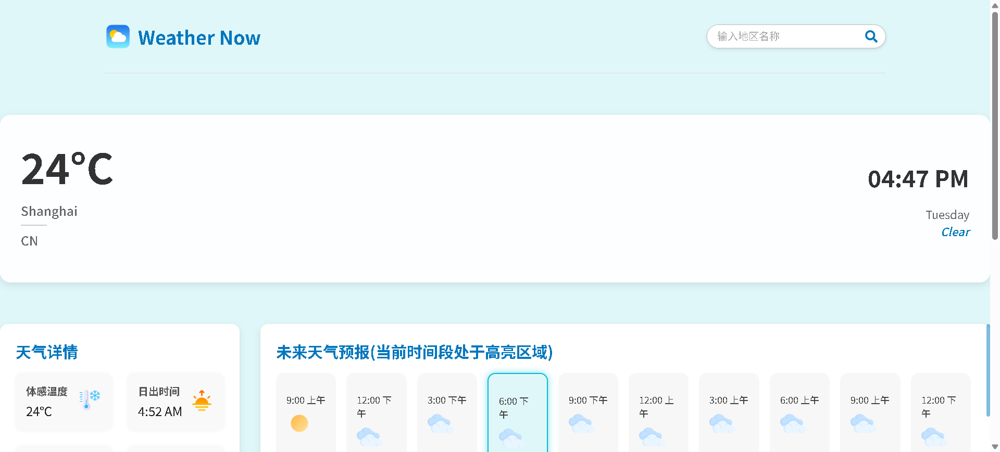

# 📦 React 小项目合集

欢迎来到 **React 小项目合集**！🎉

本仓库汇集了一系列使用 React 构建的小型应用程序。创建这些项目的目的是为了帮助初学者理解 React 的核心概念，并通过实践来巩固前端开发技能。每个项目都侧重于特定的 React 特性或前端技术点。

## 🎯 学习目标

通过学习和实践本合集中的项目，你将能够：

- 掌握 React Hooks (如 `useState`, `useEffect`, `useContext`) 的使用。
- 理解组件化开发思想和 Props & State 的管理。
- 学习如何在 React 中处理用户事件和表单。
- 了解条件渲染和列表渲染的技巧。
- 实践前端路由 (如 React Router)。
- 体验不同的样式方案 (如 CSS Modules, Styled Components, Tailwind CSS - 根据具体项目而定)。
- 学习如何与浏览器 API (如 `localStorage`) 交互。
- 初步接触项目构建工具 (如 Vite)。

## 🛠️ 开始之前

在开始探索这些项目之前，请确保你的开发环境中已安装：

- [Node.js](https://nodejs.org/) (建议使用 LTS 版本)
- [npm](https://www.npmjs.com/) (通常随 Node.js 一同安装) 或 [yarn](https://yarnpkg.com/)

## 🚀 项目列表

以下是本合集中包含的项目：

### 项目 1: 备忘录应用 (Todo List App)

一个简单的任务管理应用，支持添加、删除、排序任务，并具备明暗主题切换功能。

**主要技术栈：** React, Vite, CSS Modules

**学习重点：** `useState`, `useEffect`, `useContext`, `localStorage`, 事件处理, 条件渲染

**难度：** 初级

**效果展示：**


[查看详情](./项目1/project001/README.md)

### 项目 2: 背景颜色修改项目

（灵感来自于：https://github.com/adesh9201/bgChanger）

一个简单的背景颜色项目，可以通过选取 input-type：color 的颜色值，切换背景颜色，查看历史颜色记录、复制颜色的 HEX 值等功能。

**主要技术栈：** React, Vite, CSS Modules,ESLint

**学习重点：** Vite 配置, React 基础设置, ESLint 规则配置

**难度：** 初级

**效果展示：**


[查看详情](./项目2/project002/README.md)

### 项目 3: 个人作品集网站

一个使用 React 18 + Vite + Framer Motion + Tailwind CSS 构建的响应式个人作品集网站，支持暗色/亮色模式切换。

**主要技术栈：** React 18, Vite, Framer Motion, Tailwind CSS

**学习重点：** 响应式设计, 动画效果, 主题切换, 组件复用

**难度：** 中级

**效果展示：**

[查看详情](./项目3/project003/README.md)

### 项目 4: Weather Now - React 天气应用

一个基于 React 和 OpenWeatherMap API 开发的天气查询应用，支持实时天气查询、天气预报和动态主题切换。

**主要技术栈：** React 18, Vite, Axios, OpenWeatherMap API

**学习重点：** API 调用, Hooks 应用, 动态主题, 数据可视化

**难度：** 中级

**效果展示：**



[查看详情](./项目4/README.md)

_更多精彩项目持续更新中..._

## 📖 如何运行单个项目

每个项目都是独立的，可以单独运行。请按照以下步骤操作：

1.  **克隆本仓库** (如果你还没有这样做)：

    ```bash
    git clone https://github.com/game-diot/Small-project-collection.git
    cd Small-project-collection
    ```

2.  **进入特定项目目录**：
    例如，要运行"项目 1: 备忘录应用"：

    ```bash
    cd "项目1/project001"
    ```

    _(请根据你想要运行的项目，替换上面的路径)_

3.  **安装项目依赖**：
    在项目各自的目录下，运行：

    ```bash
    npm install
    ```

    或者，如果你使用 yarn：

    ```bash
    yarn install
    ```

4.  **启动开发服务器**：
    大多数项目使用 Vite，启动命令通常是：

    ```bash
    npm run dev
    ```

    或者，对于使用 Create React App 创建的项目，可能是：

    ```bash
    npm start
    ```

    _(请查看具体项目的 `package.json` 文件中的 `scripts` 部分以确认启动命令)_

5.  **在浏览器中查看**：
    启动成功后，终端会显示一个本地服务器地址 (通常是 `http://localhost:xxxx`)，在浏览器中打开此地址即可查看项目。

## 🌟 贡献指南

我们非常欢迎你为这个项目合集做出贡献！无论是添加新的小项目、改进现有项目、修复 Bug，还是完善文档，你的帮助都将使这个合集变得更好。

如果你有任何想法或建议：

1.  **Fork** 本仓库。
2.  创建你的特性分支 (`git checkout -b feature/AmazingFeature`)。
3.  提交你的更改 (`git commit -m 'Add some AmazingFeature'`)。
4.  将你的分支推送到远程仓库 (`git push origin feature/AmazingFeature`)。
5.  提交一个 **Pull Request**。

也欢迎通过 [Issues](https://github.com/game-diot/Small-project-collection/issues) (请替换为你的实际仓库 Issues 链接) 来报告问题或提出建议。

---

祝你学习愉快，编码顺利！ 🚀
